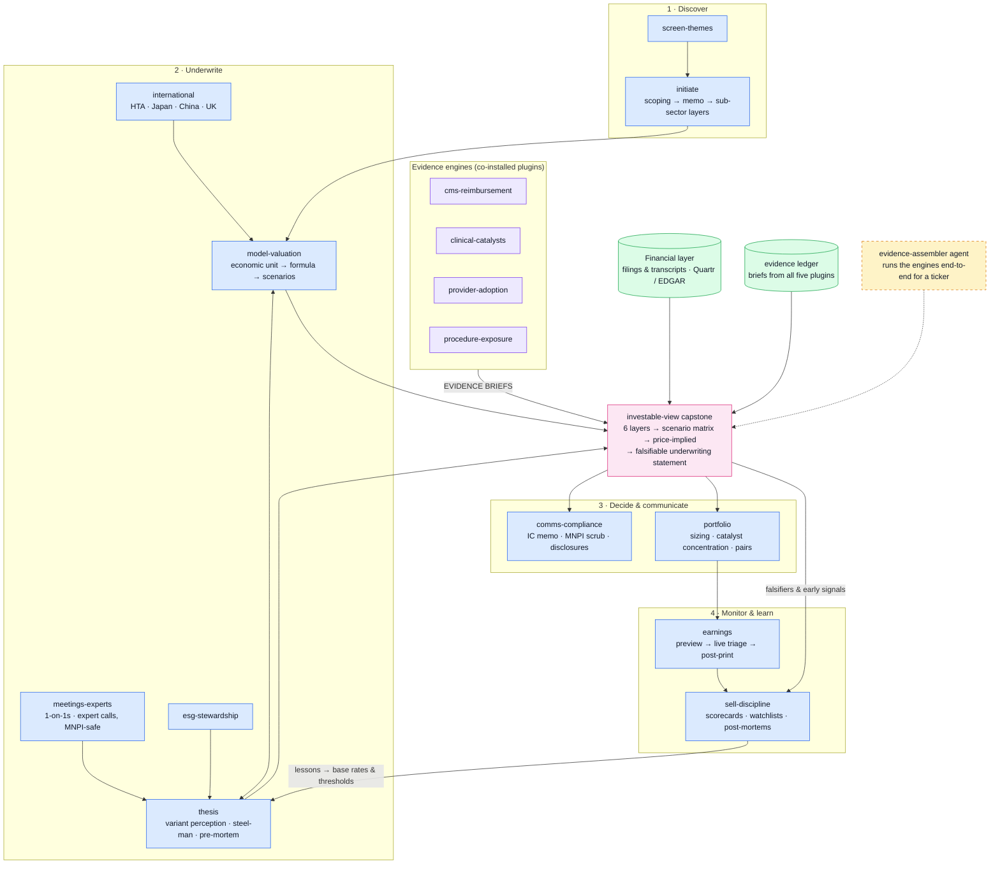

# healthcare-equity

Synthesis engine for buy-side healthcare equity research — the analyst methodology from the Healthcare Equity Analyst Prompt Library v1.4 (94 of its 113 prompts live here; 19 live beside their data sources in the engine plugins), plus the investable-view capstone built on the Healthcare Evidence-to-Valuation Framework.

One of five plugins in the healthcare analyst suite: the engines — `cms-reimbursement` (access/payment), `clinical-catalysts` (science/trials/FDA), `provider-adoption` (prescriber/site capacity), `procedure-exposure` (codes/volumes) — produce standardized evidence briefs; this plugin synthesizes them with financial evidence into models, theses, and investable views.

## Components

| Type | Name | Purpose (prompt IDs carried) |
|---|---|---|
| Skill | initiate | New-name coverage: scoping → full memo → sub-sector layers (INIT-01/02/04/05/06/07, SS-02) |
| Skill | earnings | Preview → live triage → post-print → guide decomposition + sub-sector quarterly reads (EARN-01…07, SS-03, COMM-03, SUB-PHA-03, SUB-SVC-01) |
| Skill | model-valuation | DCF stress, SOTP, rNPV, LOE, razor-blade, capex-cycle, MA Stars, digital-health UE, forensics, scenarios + sub-sector models (MOD-01…10, SUB-PHA-01/04/05, SUB-MED-05, SUB-SVC-03/04, SUB-TLS-02/04) — carries the Evidence-to-Valuation and Commercial Metrics distillations |
| Skill | thesis | Variant perception, pre-mortem, steel-man, decomposition, regime map, PM/IC dynamics (INIT-03, THES-01…05, SS-01, PORT-05/06, SUB-DIG-02) |
| Skill | screen-themes | Idea screens, thematic validation → TAM → baskets, terminal syntax (SCR-01/03/04/05, THM-01…03, SUB-PHA-02, SUB-TLS-01, TECH-01/03/04) |
| Skill | portfolio | Sleeve review, catalyst concentration, pairs, shorts, 13F, correlations, EDGAR monitoring (PORT-01…04, SCR-06/07, TECH-05) |
| Skill | meetings-experts | 1-on-1s, site visits, KOL days, expert-network arc (MGMT-01…04, EN-01…04, SUB-DIG-01) |
| Skill | sell-discipline | Scorecards, watchlists, post-mortems, annual audit (SELL-01…05) |
| Skill | international | EU HTA/JCA, Japan, China/BIOSECURE, UK (INTL-01…04) |
| Skill | comms-compliance | IC memos, LP letters, generalist translation, MNPI scrub, disclosures (COMM-01/02/04/05/06/07) |
| Skill | esg-stewardship | Materiality, engagement, access, climate (ESG-01/02/04/05, SUB-DIG-03) |
| Skill | investable-view | **Capstone:** assembles the five evidence layers → scenario matrix → valuation map → falsifiable view |
| Agent | evidence-assembler | Ticker → runs the engines' skills → drafts the investable view |

## Workflow



*Blue = skills · green = data sources & stores · amber (dashed) = agents · pink = evidence outputs · violet = suite handoffs.*

<!-- standalone-install:start -->
## Installation

This standalone distribution is published as **HH-healthcare-equity**; the plugin inside keeps its suite id `healthcare-equity`. Two ways to install — **pick one**, not both (both distribute the same plugin under the same name):

**Standalone (this repo):**

```shell
/plugin marketplace add <your-github-username>/HH-healthcare-equity
/plugin install healthcare-equity@HH-healthcare-equity
```

**As part of the five-plugin suite (recommended if you want the full evidence→investable-view chain):**

```shell
/plugin marketplace add <your-github-username>/claude-healthcare-analyst-suite
/plugin install healthcare-equity@healthcare-analyst-suite
```

Updates: `/plugin marketplace update HH-healthcare-equity` (standalone) or `/plugin marketplace update healthcare-analyst-suite` (suite). If you switch sources later, uninstall the plugin first, then remove the old marketplace.
<!-- standalone-install:end -->

## Setup

- **No MCP servers by design** — this plugin consumes the engines' connectors (install all five together), the Quartr connector for transcripts/filings, and web/EDGAR. Optional depth layer: the Rhizome AI connector for FDA/EMA primary-document research (routed via the CLAUDE.md connector map); the breadth-vs-depth buying taxonomy lives in `references/data-stack-map.md`.
- Excel builds hand off to model-builder / financial-analysis; earnings model updates to earnings-reviewer.
- Uninstall the old `healthcare`, `cms-coverage`, `npi-registry`, and deprecated `pubmed` plugins after installing the suite.

## Usage

Say what you'd say to a junior analyst: "initiate on [TICKER]", "preview the print", "build the rNPV", "steel-man my short case", "screen for hidden compounders", "prep my 1-on-1", "run the quarterly scorecards", "map the EU HTA path", "draft the IC memo" — or "**build the investable view for [TICKER]**" to run the capstone end to end.

## Smoke test

Ask: **"Run the sell-discipline scorecard on [TICKER]; here is my thesis: …"** — pass: six 0–3 scores with the banded verdict and a confidence score. Then ask: **"Build the investable view for [TICKER]"** — pass: five layer briefs (or declared skips) with openable citations, a scenario set whose probabilities sum to 1.00 with a ≥5% unknown-unknown residual, and the template sentence with a dated catalyst and falsifier.
The universal pass condition, per the suite contract: an output must **move a model variable with an openable citation** — an output that merely informs, or cites without resolving, fails.
