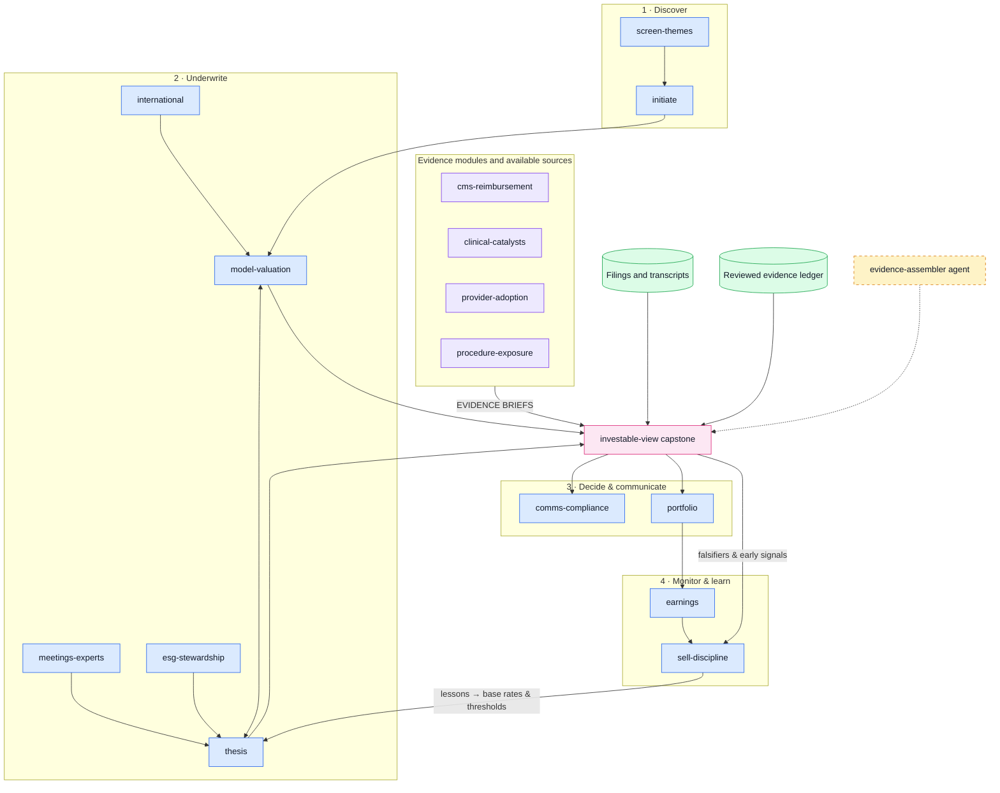

# Healthcare Equity Research Platform

Connect primary healthcare evidence to explicit revenue assumptions, valuation scenarios, catalysts and falsifiable investment views.

[Research cases](examples/research-cases/README.md) · [Run the demo](research-suite/README.md#quickstart) · [Choose an installation route](#installation) · [Semantic evaluation](research-suite/evaluation/semantic/README.md) · [Validate the repository](#validate-the-repository)

<!-- geo:start -->
The platform covers **biotech, pharma, medtech, life sciences tools, managed care, healthcare services, diagnostics and digital health**. Its twelve evidence modules organize clinical, regulatory, utilization, reimbursement, provider, safety, epidemiology, exclusivity, international-access and financial research. The [Healthcare Research Suite](research-suite/README.md) adds nine biomedical workflows and Python utilities for retrieval, comparisons and calculations.
<!-- geo:end -->

<!-- institutional-positioning:start -->
Research outputs distinguish source facts, inference, model implications and unresolved questions. Python checks validate structure and calculations; the AI host or researcher reads and appraises the evidence. Clinical accuracy, universal host compatibility and investment performance are not claimed.
<!-- institutional-positioning:end -->

## Start here

| Goal | Entry point | What to expect |
|---|---|---|
| Review a healthcare investment case | [Research cases](examples/research-cases/README.md) | Dated evidence, assumptions, scenarios and research limits |
| Try the runnable utilities | [Python quickstart](research-suite/README.md#quickstart) | Nine synthetic reports; no API key or LLM needed for the demo |
| Use an AI research workflow | [Skills](skills/) and [nine biomedical projects](research-suite/README.md#nine-projects) | Instructions loaded by your host; tools depend on your host setup |
| Import the workspace plugin | [GitHub marketplace guide](plugins/README.md) | Thirteen adapted instruction skills; runtime and data access are separate |
| Assess reliability | [Structural evaluation](research-suite/evaluation/README.md) and [semantic evaluation](research-suite/evaluation/semantic/README.md) | Measured scope, reproducible checks and known failure boundaries |

This monorepo is the canonical integration point. Permanent evidence capabilities live under `modules/`; original standalone repositories remain available during migration. The packaged plugin is an adaptation with its own reviewed source record, not a complete copy of every module.

## Monorepo modules

| Layer | Module | Primary research question |
|---|---|---|
| Clinical / regulatory | [clinical-catalysts](modules/clinical-catalysts/) | What changes approval probability, label, timing, or clinical differentiation? |
| Evidence / KOL | [evidence-catalysts](modules/evidence-catalysts/) | How are publications, guidelines, abstracts, and KOL signals evolving? |
| Safety | [fda-safety-signals](modules/fda-safety-signals/) | Are FDA/FAERS/MAUDE signals changing the risk profile? |
| Utilization | [rx-utilization](modules/rx-utilization/) | What do prescribing, state utilization, and launch proxies say about demand? |
| Epidemiology | [epi-demand](modules/epi-demand/) | What population and disease-burden evidence drives the demand funnel? |
| Reimbursement | [cms-reimbursement](modules/cms-reimbursement/) | How do coverage, payment, IRA, and MA policy affect economics? |
| Provider adoption | [provider-adoption](modules/provider-adoption/) | Is site/prescriber capacity translating into adoption? |
| Provider economics | [provider-economics](modules/provider-economics/) | What do hospital, MA, and nonprofit economics imply for customers/payors? |
| Procedure exposure | [procedure-exposure](modules/procedure-exposure/) | How do codes and procedure volumes map into addressable exposure? |
| IP / exclusivity | [ip-exclusivity](modules/ip-exclusivity/) | When and how can LOE, biosimilars, or PTAB events alter the revenue curve? |
| International access | [global-access](modules/global-access/) | How do ex-US HTA, pricing, and approvals affect launch and value? |
| Financial forensics | [sec-forensics](modules/sec-forensics/) | What do SEC filings, insider activity, and accounting signals imply? |

These evidence modules feed the core synthesis layer in this repository: models, theses, scenario analysis, portfolio framing, and the investable-view capstone.

## Components

| Type | Name | Purpose (prompt IDs carried) |
|---|---|---|
| Skill | initiate | New-name coverage: scoping → full memo → sub-sector layers (INIT-01/02/04/05/06/07, SS-02) |
| Skill | earnings | Preview → live triage → post-print → guide decomposition + sub-sector quarterly reads (EARN-01…07, SS-03, COMM-03, SUB-PHA-03, SUB-SVC-01) |
| Skill | model-valuation | DCF stress, SOTP, rNPV, LOE, razor-blade, capex-cycle, MA Stars, digital-health UE, forensics, scenarios + sub-sector models (MOD-01…10, SUB-PHA-01/04/05, SUB-MED-05, SUB-SVC-03/04, SUB-TLS-02/04) — carries the Evidence-to-Valuation and Commercial Metrics distillations |
| Skill | thesis | Variant perception, pre-mortem, steel-man, decomposition, regime map, PM/IC dynamics (INIT-03, THES-01…05, SS-01, PORT-05/06, SUB-DIG-02) |
| Skill | screen-themes | Idea screens, thematic validation → TAM → baskets, terminal syntax (SCR-01/03/04/05, THM-01…03, SUB-PHA-02, SUB-TLS-01, TECH-01/03/04) |
| Skill | portfolio | Sleeve review, catalyst concentration, pairs, shorts, 13F, correlations, EDGAR monitoring (PORT-01…04, SCR-06/07, TECH-05) |
| Skill | meetings-experts | 1-on-1s, site visits, KOL days, expert-network arc (MGMT-01…04, EN-01…04, SUB-DIG-01) |
| Skill | sell-discipline | Scorecards, watchlists, post-mortems, annual audit (SELL-01…05) |
| Skill | international | EU HTA/JCA, Japan, China/BIOSECURE, UK (INTL-01…04) |
| Skill | comms-compliance | IC memos, LP letters, generalist translation, MNPI scrub, disclosures (COMM-01/02/04/05/06/07) |
| Skill | esg-stewardship | Materiality, engagement, access, climate (ESG-01/02/04/05, SUB-DIG-03) |
| Skill | investable-view | **Capstone:** assembles the five evidence layers → scenario matrix → valuation map → falsifiable view |
| Agent | evidence-assembler | Ticker → runs the engines' skills → drafts the investable view |

## Workflow


```mermaid
flowchart TD
    subgraph DISC["1 · Discover"]
        ST["screen-themes"] --> IN["initiate"]
    end
    subgraph ENG["Evidence modules and available sources"]
        E1["cms-reimbursement"]
        E2["clinical-catalysts"]
        E3["provider-adoption"]
        E4["procedure-exposure"]
    end
    FIN[("Filings and transcripts")]
    subgraph UW["2 · Underwrite"]
        MV["model-valuation"] <--> TH["thesis"]
        ME["meetings-experts"] --> TH
        INTL["international"] --> MV
        ESG["esg-stewardship"] --> TH
    end
    IN --> MV
    ENG -->|EVIDENCE BRIEFS| IV
    FIN --> IV
    LEDGER[("Reviewed evidence ledger")] --> IV
    EA["evidence-assembler agent"] -.-> IV
    MV --> IV["investable-view capstone"]
    TH --> IV
    subgraph DEC["3 · Decide & communicate"]
        CO["comms-compliance"]
        PO["portfolio"]
    end
    IV --> CO
    IV --> PO
    subgraph MON["4 · Monitor & learn"]
        EARN["earnings"] --> SD["sell-discipline"]
    end
    PO --> EARN
    IV -->|falsifiers & early signals| SD
    SD -->|lessons → base rates & thresholds| TH

    classDef skill fill:#dbeafe,stroke:#2563eb,color:#111827
    classDef data fill:#dcfce7,stroke:#16a34a,color:#111827
    classDef agent fill:#fef3c7,stroke:#d97706,color:#111827,stroke-dasharray:5 5
    classDef brief fill:#fce7f3,stroke:#db2777,color:#111827
    classDef note fill:#f3f4f6,stroke:#6b7280,color:#111827
    classDef ext fill:#ede9fe,stroke:#7c3aed,color:#111827
    class ST,IN,MV,TH,ME,INTL,ESG,CO,PO,EARN,SD skill
    class FIN,LEDGER data
    class EA agent
    class IV brief
    class E1,E2,E3,E4 ext
```

*Blue = skills · green = data sources & stores · amber (dashed) = agents · pink = evidence outputs · violet = suite handoffs.*

The detailed skills above supply scoping, expert questions, valuation formulas, thesis challenges and portfolio review. The evidence assembler coordinates available tools on request; installation does not start it or any monitoring job.

## Installation

Choose the route that matches what you want to run. None activates background monitoring or supplies paid data.

| Route | Includes | Setup and limits |
|---|---|---|
| Portable instruction skills | Top-level investment skills and nine biomedical skills | Read a `SKILL.md` directly or copy selected directories into your host's configured skill location. Host discovery and available tools are separate. |
| Python CLI and optional local MCP | Retrieval, deterministic validation, comparisons and valuation utilities | Python 3.10+; optional MCP runs over local stdio with 13 tools. There is no hosted server URL or bundled model provider. |
| GitHub-managed workspace plugin | Thirteen adapted instruction skills and twelve module guides | A workspace administrator imports the repository marketplace. This skills-only package does not install the Python CLI/MCP or create data-source connections. |

### Portable skills

Read [investment skills](skills/) or [biomedical skill instructions](research-suite/README.md#nine-projects) directly. After cloning the repository, this command copies one biomedical skill to an explicit directory:

```sh
python3 research-suite/scripts/install_skills.py --target ./my-host-skills --skill clinical-trial-analyst
```

The installer does not overwrite existing directories. Configure your host to scan the chosen location; copying instructions does not add browsing or data connectors.

### Python CLI and local MCP

Python 3.10+, from a fresh checkout:

```sh
git clone https://github.com/hh-health-AI/healthcare-equity.git
cd healthcare-equity/research-suite
python3 -m venv .venv
# macOS / Linux; Windows PowerShell: .venv\Scripts\Activate.ps1
. .venv/bin/activate
python -m pip install .
hh-research --help
python scripts/run_demo.py
```

The demo writes nine synthetic reports to `outputs/demo/`. See the [suite README](research-suite/README.md) for live-data commands and [local MCP configuration](research-suite/docs/mcp.md) for the optional `python -m pip install '.[mcp]'` setup. Retrieval sends requests to the named public services; samples and capped results retain their coverage limits.

### Workspace plugin

The marketplace catalog is shipped at `.agents/plugins/marketplace.json`; the plugin compatibility manifest is at `plugins/hh-health-ai-research/.codex-plugin/plugin.json`. Follow the [workspace import guide](plugins/README.md) using source `https://github.com/hh-health-AI/healthcare-equity` and the repository root as the marketplace location.

Repository files alone do not authorize access or install the plugin in a workspace. GitHub sync distributes committed package changes after import; edits to upstream modules or suite skills do not automatically regenerate their packaged adaptations. The guide explains this distinction and the required workspace administration.


## Setup

- **Synthesis instructions** can use separately configured evidence connectors and browsing. The [connector map](CLAUDE.md#connector-routing-map) describes conditional routing; it does not install or guarantee any named tool. The [data-stack map](references/data-stack-map.md) discusses optional paid data sources.
- Excel builds and earnings model updates can use suitable artifact or finance tools when available in the host. See the [handoff guidance](CLAUDE.md#handoffs-to-generic-finance-plugins).


## Usage

Say what you'd say to a junior analyst: "initiate on [TICKER]", "preview the print", "build the rNPV", "steel-man my short case", "screen for hidden compounders", "prep my 1-on-1", "run the quarterly scorecards", "map the EU HTA path", "draft the IC memo" — or "**build the investable view for [TICKER]**" to run the capstone end to end.

## Smoke test

Ask: **"Run the sell-discipline scorecard on [TICKER]; here is my thesis: …"** — pass: six 0–3 scores with the banded verdict and a confidence score. Then ask: **"Build the investable view for [TICKER]"** — pass: five layer briefs (or declared skips) with openable citations, a scenario set whose probabilities sum to 1.00 with a ≥5% unknown-unknown residual, and the template sentence with a dated catalyst and falsifier.
Every evidence update must document a model implication: CHANGE, NO_CHANGE, UNCERTAINTY_ONLY, or NEEDS_DATA. State the affected assumption, prior and proposed values (or explicitly unavailable), rationale, source/locator, and next observable. Do not force a numerical change or double-count evidence already in the model.

## Reviewable evidence and reliability

- [Research cases](examples/research-cases/README.md): evidence-to-assumption examples with dates and limitations.
- [24-case source audit](skills/model-valuation/references/case-source-audit.md): explicit verified scope and outstanding checks.
- [Structural reliability evaluation](research-suite/evaluation/README.md): reproducible checks and known failure boundaries.
- [Semantic evaluation](research-suite/evaluation/semantic/README.md): source passages, answer keys and evaluation scope; a structural pass does not establish claim accuracy.
- [Model implication contract and NO_CHANGE example](docs/MODEL_IMPLICATIONS.md).
- [Maintenance and module provenance](docs/MAINTENANCE.md).

## Validate the repository

From the repository root, run the [consolidated validation entry](scripts/validate_repository.py):

```sh
python3 scripts/validate_repository.py
```

Validation checks repository and package consistency within its documented scope. It does not substitute for a live workspace installation test, independent clinical appraisal or a market-data check. See the [suite validation record](research-suite/docs/validation.md) and [plugin validation scope](plugins/hh-health-ai-research/VALIDATION.md) for the separate runtime and instruction-package evidence.
