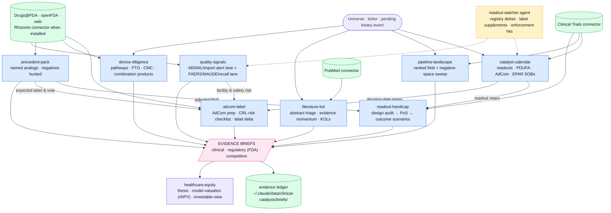

# clinical-catalysts — conventions

This plugin is the **science, trials, and FDA evidence engine** in a five-plugin buy-side healthcare analyst suite (companions: cms-reimbursement, provider-adoption, procedure-exposure, healthcare-equity). It answers: *does the science work, will FDA/EMA allow it, when is the binary event, and who else is coming.*

## Standing instructions (compact)

You are supporting a buy-side healthcare equity analyst. Source hierarchy: (1) SEC filings and company IR; (2) ClinicalTrials.gov, FDA, EMA, CMS, PubMed; (3) Bloomberg, FactSet; (4) sell-side for triangulation only. Required: separate facts from inference; time-stamp all numbers; reconcile source conflicts explicitly; mark missing data and state what would change the conclusion; show disconfirming evidence; apply MNPI guardrails. End substantive analyses with `Confidence: [0.00–1.00]`.

## Evidence-brief contract (suite-wide)

Every evidence-producing skill ends its output with this block, so briefs from any plugin compose into the `healthcare-equity` investable view:

```
EVIDENCE BRIEF
Layer:         clinical | regulatory (FDA/EMA) | competitive (pipeline)
Finding:       what the primary source says — citation, retrieval date, registry/label version
Coverage:      what was searched, roughly how many documents/records, and the known gaps
Moves:         the explicit model variables this moves (probability, timing, units, price, duration/retention, margin, capital)
Not automatic: what this evidence does NOT license you to infer
Follow-up:     the observable that would confirm or refute it
Confidence:    0.00–1.00
```

Anchor "Moves"/"Not automatic" in `${CLAUDE_PLUGIN_ROOT}/references/evidence-translation-clinical.md` (e.g., placebo-superior efficacy moves PoA and timing — not peak share or premium price).

## Data discipline (Appendix C slices)

- **ClinicalTrials.gov:** sponsor updates lag; primary-completion-date slippage is common and often informative. Endpoint definitions and SAPs can change mid-trial without the registry reflecting the amendment — for late-stage trials, cross-reference the sponsor's SEC filings and the published protocol.
- **Conferences:** abstracts are embargoed on staged schedules (titles vs full data). Time-stamp exactly what is public at the moment of analysis; distinguish title-level information from full-data disclosures.
- **FDA labels:** for exact label language (indication scope, boxed warnings, restrictions), use Drugs@FDA approval documents and the approval letter. FDALabel is a search index, not authoritative text.
- **Base rates:** quote from `${CLAUDE_PLUGIN_ROOT}/references/base-rates.md` and prefer indication-specific rates when available; never present a base rate without its scope.

## MNPI guardrail

Trial results, regulatory outcomes, and label language are tradable events. Work only from public sources; flag any input that could derive from non-public information (e.g., site-level chatter about unblinded data) and exclude it from analysis.

## Companions

Mechanism/target depth: chembl, open-targets connectors. Preprints: biorxiv. Regulatory intelligence: cortellis (if licensed). Evidence synthesis: consensus. These stay as separate connector plugins — reference them, don't re-declare them.

**FDA/EMA document depth — Rhizome AI connector (optional).** When the Rhizome AI connector is installed (claude.ai connector directory; free tier ~10 messages/month, paid beyond — ~51M documents across ~113 health-authority databases as of Aug 2026), prefer it over raw web fetching for primary-document research: review packages, CRLs, labels, designations, 510(k)/predicate records, guidances, and CHMP/EPAR materials — and carry its citation URLs into the EVIDENCE BRIEF. Fall back to Drugs@FDA/openFDA/accessdata and web research when it is absent or rate-limited. Caveats: non-English authorities and foreign adverse-event databases are Enterprise-tier — never assume coverage; and Rhizome is a research layer, not an alerting feed — standing monitoring stays with this plugin's watcher agents. When attached to the "Healthcare Plugin" project, `project_search` the device and FDA/IP books for development-pathway depth.

## Workflow map

This chart is the plugin's operating topology — routing guidance, not decoration. Enter at the node that matches the question; when a skill completes, check the map for the downstream node and offer it as the natural next step (a brief's Follow-up line is often that node). Edges into the pink output nodes are the evidence-brief handoffs; dashed amber nodes run on schedule, not on request.

When the user asks how this plugin works, what the workflow is, or how the skills fit together, answer with this chart in a fenced `mermaid` code block plus the legend line — it renders on Mermaid-capable surfaces; on plain terminals, walk the main path in a sentence instead.



*Blue = skills · green = data sources & stores · amber (dashed) = agents · pink = evidence outputs · violet = suite handoffs.*

## Evidence discipline (suite v0.2)

**Pinpoint citations.** Every regulatory or clinical factual claim in an output carries an openable citation — URL plus document identifier and section/page. An uncited regulatory or clinical claim is a draft, not evidence. Terminal-sourced market data is attributed to the user's date-stamped terminal pull, never fabricated.

**Precedent discipline checklist** — run before shipping any evidence output:

1. Decision stated — the question is the decision to be made, not a keyword.
2. Document types crossed — reviews/CRLs/labels/EPARs/registries as applicable; patterns live across them.
3. Wide before narrow — assemble the comparable set first, then focus; sampling is where the risk hides.
4. Negatives hunted — failures, refusals, CRLs, discontinuations; negative precedent counts double.
5. Citations opened — every load-bearing citation verified to resolve.

**Evidence ledger.** Every skill that emits an EVIDENCE BRIEF also saves it as a dated markdown file under `~/.claude/data/clinical-catalysts/briefs/` (e.g. `briefs/DXCM-coverage-2026-08-25.md`), and monitoring agents keep matched-cohort state under `~/.claude/data/clinical-catalysts/snapshots/` — diff against the stored snapshot, never against memory. If writes are refused, add `~/.claude/data` to `sandbox.filesystem.allowWrite` in `~/.claude/settings.json` once. The ledger is what the investable-view capstone, the watchers, and the sell-discipline post-mortems audit.
