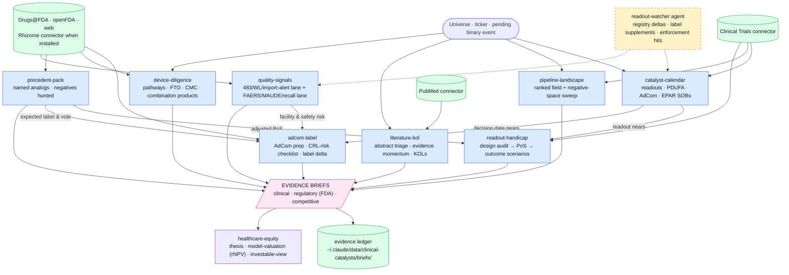

# clinical-catalysts

Science, trials, and FDA evidence engine for buy-side healthcare equity research. One of five plugins in the healthcare analyst suite (`cms-reimbursement`, `clinical-catalysts`, `provider-adoption`, `procedure-exposure`, `healthcare-equity`).

Answers: **does the science work, will FDA/EMA allow it, when is the binary event, and who else is coming** — delivered as evidence briefs the `healthcare-equity` plugin assembles into an investable view.

Built to institutional investor standards: rigorous and auditable. 

## Components

| Type | Name | Purpose |
|---|---|---|
| MCP server | Clinical Trials (hosted) | ClinicalTrials.gov search, trial details, endpoints, sponsors, investigators |
| MCP server | PubMed (hosted) | Biomedical literature search and metadata |
| Skill | catalyst-calendar | Readouts, PDUFA dates, AdComs → ranked 6-month event list |
| Skill | readout-handicap | Trial-design audit, base rates, PoS decomposition, outcome scenarios |
| Skill | adcom-label | AdCom preparation and 48-hour post-approval label-delta analysis |
| Skill | pipeline-landscape | Every asset in an indication/mechanism, ranked — the competitive brief |
| Skill | literature-kol | Conference abstract triage, evidence-momentum scans, KOL mapping |
| Skill | device-diligence | TPP, CMC/COGS, FTO, FDA meeting history, 510(k)/De Novo/PMA, LDT, CDx, combination products |
| Skill | precedent-pack | Named historical analogs for any binary event — wide-then-narrow, negatives hunted |
| Skill | quality-signals | 483/WL/import-alert facility risk + FAERS/MAUDE/recall safety signals |
| Agent | readout-watcher | Scheduled CT.gov delta scan + label-supplement and enforcement sweeps on the watchlist |

## Workflow



*Blue = skills · green = data sources & stores · amber (dashed) = agents · pink = evidence outputs · violet = suite handoffs.*

<!-- standalone-install:start -->
## Installation

This standalone distribution is published as **HH-clinical-catalysts**; the plugin inside keeps its suite id `clinical-catalysts`. Two ways to install — **pick one**, not both (both distribute the same plugin under the same name):

**Standalone (this repo):**

```shell
/plugin marketplace add <your-github-username>/HH-clinical-catalysts
/plugin install clinical-catalysts@HH-clinical-catalysts
```

**As part of the five-plugin suite (recommended if you want the full evidence→investable-view chain):**

```shell
/plugin marketplace add <your-github-username>/claude-healthcare-analyst-suite
/plugin install clinical-catalysts@healthcare-analyst-suite
```

Updates: `/plugin marketplace update HH-clinical-catalysts` (standalone) or `/plugin marketplace update healthcare-analyst-suite` (suite). If you switch sources later, uninstall the plugin first, then remove the old marketplace.
<!-- standalone-install:end -->

## Setup

- No environment variables; both servers are hosted connectors.
- Install alongside the other four suite plugins; uninstall the old `healthcare`, `cms-coverage`, `npi-registry`, and deprecated/standalone `pubmed` + `clinical-trials` plugins so each connector registers once.
- Optional depth layer: install the **Rhizome AI** connector from the claude.ai connector directory — skills prefer it for FDA/EMA primary-document research (reviews, CRLs, predicates, designations) and fall back to web when absent.

## Usage

- "Build the catalyst calendar for the next 6 months" → catalyst-calendar
- "Handicap [TICKER]'s Phase 3 in [indication]" → readout-handicap
- "Prep the AdCom" / "analyze the approved label vs expectations" → adcom-label
- "Map everything in development for [indication/mechanism]" → pipeline-landscape
- "Triage the [ASCO/AHA/ESMO] abstracts" / "what's the literature saying about X" → literature-kol
- "Check the 510(k) predicate / FTO / CMC risk for [TICKER]" → device-diligence
- "Build the precedent pack for [event]" / "what has FDA actually accepted for X" → precedent-pack
- "Any warning letters / 483s / safety signals on [TICKER]?" → quality-signals
- "Watch my names for trial changes" → schedule the readout-watcher agent

## Smoke test

Ask: **"Build a 90-day catalyst calendar for [two or three covered tickers]."**
Pass: dated events carrying NCT IDs and registry timestamps (plus PDUFA/AdCom sources), with sponsor-guidance vs registry dates distinguished; deep-dived events end with an EVIDENCE BRIEF whose citations open. The output must move model variables (timing/probability), not merely list news.
Fail tell: event dates without NCT IDs or openable citations mean the Clinical Trials connector was not called.
