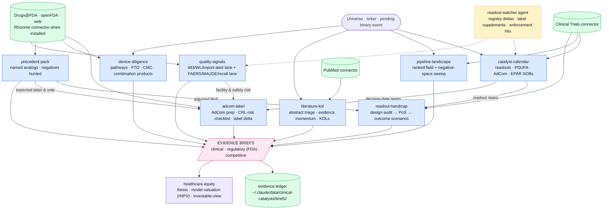

# clinical-catalysts

Science, trials and FDA evidence workflows for healthcare equity research. This directory is the flagship's integrated `clinical-catalysts` module; the [standalone source](https://github.com/hh-health-AI/clinical-catalysts) remains available.

Answers: **does the science work, will FDA/EMA allow it, when is the binary event, and who else is coming** — delivered as evidence briefs the `healthcare-equity` plugin assembles into an investable view.

Instructions organize source evidence and explicit model implications; their output requires researcher appraisal.

## Components

| Type | Name | Purpose |
|---|---|---|
| Optional connector | Clinical Trials | ClinicalTrials.gov search, trial details, endpoints, sponsors, investigators |
| Optional connector | PubMed | Biomedical literature search and metadata |
| Skill | catalyst-calendar | Readouts, PDUFA dates, AdComs → ranked 6-month event list |
| Skill | readout-handicap | Trial-design audit, base rates, PoS decomposition, outcome scenarios |
| Skill | adcom-label | AdCom preparation and 48-hour post-approval label-delta analysis |
| Skill | pipeline-landscape | Every asset in an indication/mechanism, ranked — the competitive brief |
| Skill | literature-kol | Conference abstract triage, evidence-momentum scans, KOL mapping |
| Skill | device-diligence | TPP, CMC/COGS, FTO, FDA meeting history, 510(k)/De Novo/PMA, LDT, CDx, combination products |
| Skill | precedent-pack | Named historical analogs for any binary event — wide-then-narrow, negatives hunted |
| Skill | quality-signals | 483/WL/import-alert facility risk + FAERS/MAUDE/recall safety signals |
| Agent | readout-watcher | Scheduled CT.gov delta scan + label-supplement and enforcement sweeps on the watchlist |

## Workflow


```mermaid
flowchart TD
    U(["Universe · ticker · pending binary event"]) --> CAL["catalyst-calendar<br/>readouts · PDUFA · AdCom · EPAR SOBs"]
    U --> PL["pipeline-landscape<br/>ranked field + negative-space sweep"]
    U --> LK["literature-kol<br/>abstract triage · evidence momentum · KOLs"]
    U --> DD["device-diligence<br/>pathways · FTO · CMC · combination products"]

    CAL -->|readout nears| RH["readout-handicap<br/>design audit → PoS → outcome scenarios"]
    CAL -->|decision date nears| AL["adcom-label<br/>AdCom prep · CRL-risk checklist · label delta"]
    PP["precedent-pack<br/>named analogs · negatives hunted"] -->|adjusted PoS| RH
    PP -->|expected label & vote| AL
    QS["quality-signals<br/>483/WL/import-alert lane + FAERS/MAUDE/recall lane"] -->|facility & safety risk| AL

    CT[("Clinical Trials connector")] --> CAL
    CT --> PL
    CT --> RH
    PM[("PubMed connector")] --> LK
    FDA[("Drugs@FDA · openFDA · web<br/>Rhizome connector when installed")] --> AL
    FDA --> DD
    FDA --> PP
    FDA --> QS

    RW["readout-watcher agent<br/>registry deltas · label supplements · enforcement hits"] -.-> CAL
    RW -.-> QS

    RH --> BRIEF[/"EVIDENCE BRIEFS<br/>clinical · regulatory (FDA) · competitive"/]
    AL --> BRIEF
    PL --> BRIEF
    LK --> BRIEF
    DD --> BRIEF
    PP --> BRIEF
    QS --> BRIEF
    BRIEF --> LEDGER[("evidence ledger<br/>~/.claude/data/clinical-catalysts/briefs/")]
    BRIEF --> HE["healthcare-equity<br/>thesis · model-valuation (rNPV) · investable-view"]

    classDef skill fill:#dbeafe,stroke:#2563eb,color:#111827
    classDef data fill:#dcfce7,stroke:#16a34a,color:#111827
    classDef agent fill:#fef3c7,stroke:#d97706,color:#111827,stroke-dasharray:5 5
    classDef brief fill:#fce7f3,stroke:#db2777,color:#111827
    classDef note fill:#f3f4f6,stroke:#6b7280,color:#111827
    classDef ext fill:#ede9fe,stroke:#7c3aed,color:#111827
    class CAL,PL,LK,DD,RH,AL,PP,QS skill
    class CT,PM,FDA,LEDGER data
    class RW agent
    class BRIEF brief
    class HE ext
```

*Blue = skills · green = data sources & stores · amber (dashed) = agents · pink = evidence outputs · violet = suite handoffs.*

## Installation

Choose one of three routes. The [flagship installation guide](https://github.com/hh-health-AI/healthcare-equity#installation) describes their separate scope.

| Route | What you get | Instructions |
|---|---|---|
| Portable instruction skills | The skills in this repository, read directly or copied into a host-configured location | Your host discovers `SKILL.md` files; browsing and data tools remain separate |
| Python CLI and optional local MCP | The flagship's broader biomedical retrieval, comparison and calculation utilities | [Python quickstart](https://github.com/hh-health-AI/healthcare-equity/blob/main/research-suite/README.md#quickstart) and [local MCP guide](https://github.com/hh-health-AI/healthcare-equity/blob/main/research-suite/docs/mcp.md); not every connector in this module's workflow is supplied by that runtime |
| Workspace instruction plugin | Thirteen adapted skills with guides for twelve evidence modules | [GitHub marketplace import](https://github.com/hh-health-AI/healthcare-equity/blob/main/plugins/README.md); this skills-only edition does not import every module subskill or deploy data connections |

For the separate Python package, use Python 3.10+:

```sh
git clone https://github.com/hh-health-AI/healthcare-equity.git
cd healthcare-equity/research-suite
python3 -m venv .venv
# macOS / Linux; Windows PowerShell: .venv\Scripts\Activate.ps1
. .venv/bin/activate
python -m pip install .
python scripts/run_demo.py
```

The demo writes nine synthetic reports to `outputs/demo/`. The optional local MCP uses stdio and supplies no hosted URL. Configure source-required contact identity or credentials in the runtime environment; upstream documents `HH_CONTACT`, `NCBI_API_KEY` and `OPENFDA_API_KEY`. These values do not belong in prompts or committed files. Installation does not start monitoring jobs.

## Setup

ClinicalTrials.gov and PubMed retrieval can use your host's supported connectors, public-source browsing or user-supplied records. An optional regulatory-document connector can add depth when already configured; its availability and permissions depend on the host.

Other evidence modules can be used when the research question needs them; installing all five original suite plugins is not required. Keep any useful existing integrations and configure only the tools your host supports. Review duplicate connector names in the host configuration if needed; no automatic uninstall or account-permission change is part of this setup.

The workflow diagram describes logical handoffs. Connector nodes, host-specific ledger paths and scheduled agents are configuration examples, not resources created by installing instructions. Use an explicit storage location supported by your host, and configure a monitoring schedule only when requested.

## Usage

- "Build the catalyst calendar for the next 6 months" → catalyst-calendar
- "Handicap [TICKER]'s Phase 3 in [indication]" → readout-handicap
- "Prep the AdCom" / "analyze the approved label vs expectations" → adcom-label
- "Map everything in development for [indication/mechanism]" → pipeline-landscape
- "Triage the [ASCO/AHA/ESMO] abstracts" / "what's the literature saying about X" → literature-kol
- "Check the 510(k) predicate / FTO / CMC risk for [TICKER]" → device-diligence
- "Build the precedent pack for [event]" / "what has FDA actually accepted for X" → precedent-pack
- "Any warning letters / 483s / safety signals on [TICKER]?" → quality-signals
- "Watch my names for trial changes" → schedule the readout-watcher agent

## Smoke test

Ask: **"Build a 90-day catalyst calendar for [two or three covered tickers]."**
Pass: dated events carrying NCT IDs and registry timestamps (plus PDUFA/AdCom sources), with sponsor-guidance vs registry dates distinguished; deep-dived events end with an EVIDENCE BRIEF whose citations open. The output must document CHANGE, NO_CHANGE, UNCERTAINTY_ONLY or NEEDS_DATA for timing/probability, with rationale and a next observable.
Fail: trial event dates without source identifiers or openable citations are not reviewable. Missing evidence must be declared, whether retrieval used a connector, browsing or supplied documents.
