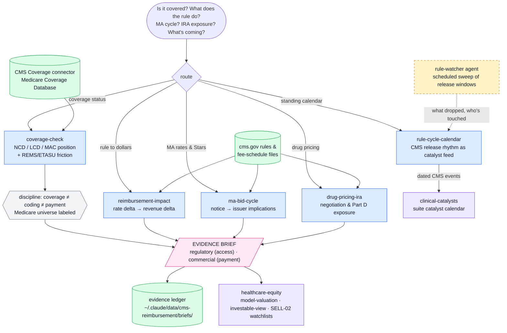

# cms-reimbursement

Access-and-payment evidence engine for buy-side healthcare equity research. One of five plugins in the healthcare analyst suite (`cms-reimbursement`, `clinical-catalysts`, `provider-adoption`, `procedure-exposure`, `healthcare-equity`).

Answers: **will Medicare pay for it, at what rate, and what is changing** — and converts the answer into model variables via a standard evidence brief that the `healthcare-equity` plugin assembles into an investable view.

Built to institutional investor standards: rigorous and auditable. 

## Components

| Type | Name | Purpose |
|---|---|---|
| MCP server | CMS Coverage (hosted) | Medicare Coverage Database — NCDs, LCDs, coverage articles |
| Skill | coverage-check | Coverage status for a drug/device/procedure, cited to policy text |
| Skill | reimbursement-impact | CMS rule change → per-procedure dollar delta → revenue impact |
| Skill | ma-bid-cycle | MA rate notice / Stars → payor implications by name |
| Skill | drug-pricing-ira | IRA negotiation, Part D redesign, inflation-rebate exposure |
| Skill | rule-cycle-calendar | Standing CMS calendar as a catalyst feed |
| Agent | rule-watcher | Scheduled sweep of CMS release windows for covered names |

## Workflow



*Blue = skills · green = data sources & stores · amber (dashed) = agents · pink = evidence outputs · violet = suite handoffs.*

<!-- standalone-install:start -->
## Installation

This standalone distribution is published as **HH-health-AI**; the plugin inside keeps its suite id `cms-reimbursement`. Two ways to install — **pick one**, not both (both distribute the same plugin under the same name):

**Standalone (this repo):**

```shell
/plugin marketplace add <your-github-username>/HH-health-AI
/plugin install cms-reimbursement@HH-health-AI
```

**As part of the five-plugin suite (recommended if you want the full evidence→investable-view chain):**

```shell
/plugin marketplace add <your-github-username>/claude-healthcare-analyst-suite
/plugin install cms-reimbursement@healthcare-analyst-suite
```

Updates: `/plugin marketplace update HH-health-AI` (standalone) or `/plugin marketplace update healthcare-analyst-suite` (suite). If you switch sources later, uninstall the plugin first, then remove the old marketplace.
<!-- standalone-install:end -->

## Setup

- No environment variables. The CMS Coverage server is a hosted connector (`hcls.mcp.claude.com`).
- Install alongside the other four suite plugins. Each hosted connector is declared in exactly one suite plugin — uninstall the old `healthcare`, `cms-coverage`, `npi-registry`, and deprecated `pubmed` plugins to avoid duplicate servers.

## Usage

- "Is TAVR / [device] / [drug] covered by Medicare?" → coverage-check
- "What does the OPPS final rule do to [TICKER]?" → reimbursement-impact
- "Walk the MA rate notice / bid cycle for [year]" → ma-bid-cycle
- "Map [TICKER]'s IRA exposure" → drug-pricing-ira
- "What CMS releases are coming?" → rule-cycle-calendar
- "Watch the CMS calendar for my coverage list" → schedule the rule-watcher agent

## Smoke test

Ask: **"Is transcatheter aortic valve replacement covered by Medicare, and under what conditions?"**
Pass: the answer cites NCD/LCD policy IDs with openable Medicare Coverage Database links, states the retrieval date and policy vintage, and ends with an EVIDENCE BRIEF (including the Coverage line). The brief must move a model variable (accessible population / paid conversion), not merely inform.
Fail tell: an answer with no policy IDs or openable links means the CMS Coverage connector was not called.
