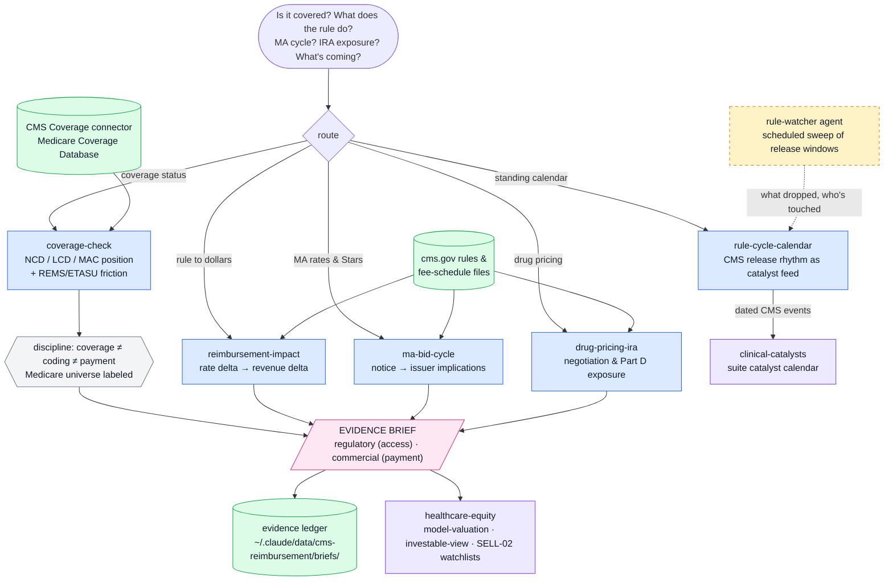

# cms-reimbursement

Access-and-payment evidence engine for buy-side healthcare equity research. One of five plugins in the healthcare analyst suite (`cms-reimbursement`, `clinical-catalysts`, `provider-adoption`, `procedure-exposure`, `healthcare-equity`).

Answers: **will Medicare pay for it, at what rate, and what is changing** — and converts the answer into model variables via a standard evidence brief that the `healthcare-equity` plugin assembles into an investable view.

Built to institutional investor standards: rigorous and auditable. 

## Components

| Type | Name | Purpose |
|---|---|---|
| MCP server | CMS Coverage (hosted) | Medicare Coverage Database — NCDs, LCDs, coverage articles |
| Skill | coverage-check | Coverage status for a drug/device/procedure, cited to policy text |
| Skill | reimbursement-impact | CMS rule change → per-procedure dollar delta → revenue impact |
| Skill | ma-bid-cycle | MA rate notice / Stars → payor implications by name |
| Skill | drug-pricing-ira | IRA negotiation, Part D redesign, inflation-rebate exposure |
| Skill | rule-cycle-calendar | Standing CMS calendar as a catalyst feed |
| Agent | rule-watcher | Scheduled sweep of CMS release windows for covered names |

## Workflow


```mermaid
flowchart TD
    Q(["Is it covered? What does the rule do?<br/>MA cycle? IRA exposure? What's coming?"]) --> R{route}
    R -->|coverage status| CC["coverage-check<br/>NCD / LCD / MAC position<br/>+ REMS/ETASU friction"]
    R -->|rule to dollars| RI["reimbursement-impact<br/>rate delta → revenue delta"]
    R -->|MA rates & Stars| MA["ma-bid-cycle<br/>notice → issuer implications"]
    R -->|drug pricing| IRA["drug-pricing-ira<br/>negotiation & Part D exposure"]
    R -->|standing calendar| CAL["rule-cycle-calendar<br/>CMS release rhythm as catalyst feed"]

    MCD[("CMS Coverage connector<br/>Medicare Coverage Database")] --> CC
    FILES[("cms.gov rules &<br/>fee-schedule files")] --> RI
    FILES --> MA
    FILES --> IRA
    RW["rule-watcher agent<br/>scheduled sweep of release windows"] -.->|what dropped, who's touched| CAL

    CC --> TRIAD{{"discipline: coverage ≠ coding ≠ payment<br/>Medicare universe labeled"}}
    TRIAD --> BRIEF[/"EVIDENCE BRIEF<br/>regulatory (access) · commercial (payment)"/]
    RI --> BRIEF
    MA --> BRIEF
    IRA --> BRIEF
    BRIEF --> LEDGER[("evidence ledger<br/>~/.claude/data/cms-reimbursement/briefs/")]
    CAL -->|dated CMS events| CATS["clinical-catalysts<br/>suite catalyst calendar"]
    BRIEF --> HE["healthcare-equity<br/>model-valuation · investable-view · SELL-02 watchlists"]

    classDef skill fill:#dbeafe,stroke:#2563eb,color:#111827
    classDef data fill:#dcfce7,stroke:#16a34a,color:#111827
    classDef agent fill:#fef3c7,stroke:#d97706,color:#111827,stroke-dasharray:5 5
    classDef brief fill:#fce7f3,stroke:#db2777,color:#111827
    classDef note fill:#f3f4f6,stroke:#6b7280,color:#111827
    classDef ext fill:#ede9fe,stroke:#7c3aed,color:#111827
    class CC,RI,MA,IRA,CAL skill
    class MCD,FILES,LEDGER data
    class RW agent
    class BRIEF brief
    class TRIAD note
    class CATS,HE ext
```

*Blue = skills · green = data sources & stores · amber (dashed) = agents · pink = evidence outputs · violet = suite handoffs.*

## Installation

The runnable Python package is maintained in [hh-health-AI/healthcare-equity](https://github.com/hh-health-AI/healthcare-equity/tree/main/research-suite). Python 3.10+:

```sh
git clone https://github.com/hh-health-AI/healthcare-equity.git
cd healthcare-equity/research-suite
python -m venv .venv
. .venv/bin/activate
python -m pip install .
python scripts/run_demo.py
```

The demo writes nine synthetic reports to `outputs/`. See the [package README](https://github.com/hh-health-AI/healthcare-equity/tree/main/research-suite) for CLI commands, optional MCP setup, and copying skills into a host. The instructions in this repository can also be read directly. Marketplace installation is not advertised: the required marketplace manifests are not shipped here.


## Setup

- No environment variables. The CMS Coverage server is a hosted connector (`hcls.mcp.claude.com`).
- Install alongside the other four suite plugins. Each hosted connector is declared in exactly one suite plugin — uninstall the old `healthcare`, `cms-coverage`, `npi-registry`, and deprecated `pubmed` plugins to avoid duplicate servers.

## Usage

- "Is TAVR / [device] / [drug] covered by Medicare?" → coverage-check
- "What does the OPPS final rule do to [TICKER]?" → reimbursement-impact
- "Walk the MA rate notice / bid cycle for [year]" → ma-bid-cycle
- "Map [TICKER]'s IRA exposure" → drug-pricing-ira
- "What CMS releases are coming?" → rule-cycle-calendar
- "Watch the CMS calendar for my coverage list" → schedule the rule-watcher agent

## Smoke test

Ask: **"Is transcatheter aortic valve replacement covered by Medicare, and under what conditions?"**
Pass: the answer cites NCD/LCD policy IDs with openable Medicare Coverage Database links, states the retrieval date and policy vintage, and ends with an EVIDENCE BRIEF (including the Coverage line). The brief must document a model implication (accessible population / paid conversion), not merely inform.
Fail tell: an answer with no policy IDs or openable links means the CMS Coverage connector was not called.
