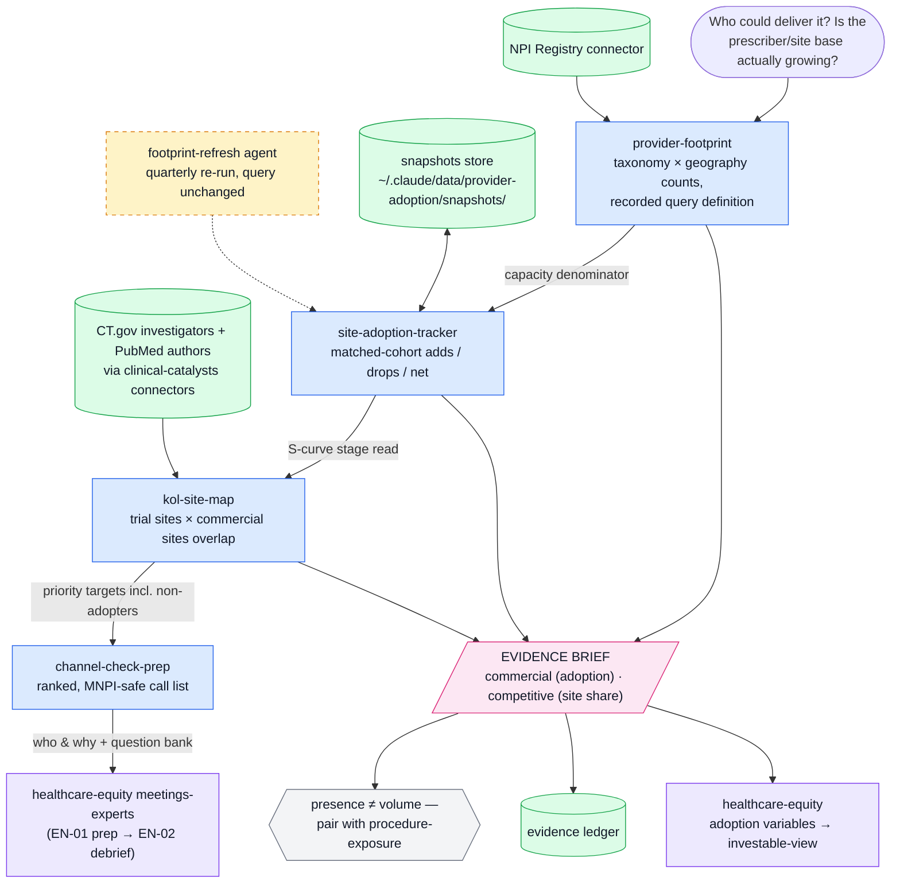

# provider-adoption

Provider and site adoption evidence engine for buy-side healthcare equity research. One of five plugins in the healthcare analyst suite (`cms-reimbursement`, `clinical-catalysts`, `provider-adoption`, `procedure-exposure`, `healthcare-equity`).

Answers: **is the prescriber/site base actually expanding, where, and how fast** — capacity-side adoption evidence delivered as briefs the `healthcare-equity` plugin assembles into an investable view. (Volume-side evidence lives in `procedure-exposure`.)

Built to institutional investor standards: rigorous and auditable. 

## Components

| Type | Name | Purpose |
|---|---|---|
| MCP server | NPI Registry (hosted) | US National Provider Identifier registry — providers, taxonomies, locations, organizations |
| Skill | provider-footprint | Prescriber/specialist counts by taxonomy and geography → addressable base |
| Skill | site-adoption-tracker | Snapshot-and-compare of sites/programs over time → adoption-curve evidence |
| Skill | kol-site-map | NPI × trial investigators × publication authors → trial-to-commercial site overlap |
| Skill | channel-check-prep | Footprint → ranked expert-network and field-call target lists |
| Agent | footprint-refresh | Quarterly matched-cohort refresh of tracked footprints |

## Workflow



*Blue = skills · green = data sources & stores · amber (dashed) = agents · pink = evidence outputs · violet = suite handoffs.*

## Installation

The runnable Python package is maintained in [hh-health-AI/healthcare-equity](https://github.com/hh-health-AI/healthcare-equity/tree/main/research-suite). Python 3.10+:

```sh
git clone https://github.com/hh-health-AI/healthcare-equity.git
cd healthcare-equity/research-suite
python -m venv .venv
. .venv/bin/activate
python -m pip install .
python scripts/run_demo.py
```

The demo writes nine synthetic reports to `outputs/`. See the [package README](https://github.com/hh-health-AI/healthcare-equity/tree/main/research-suite) for CLI commands, optional MCP setup, and copying skills into a host. The instructions in this repository can also be read directly. Marketplace installation is not advertised: the required marketplace manifests are not shipped here.


## Setup

- No environment variables; the NPI Registry server is a hosted connector.
- Install alongside the other four suite plugins; uninstall the old `healthcare`, `cms-coverage`, `npi-registry`, and deprecated `pubmed` plugins so each connector registers once.

## Usage

- "How many [specialists] could deliver [therapy/procedure], and where?" → provider-footprint
- "Track the sites offering [procedure/program] over time" → site-adoption-tracker
- "Which trial sites became commercial accounts?" / "map the KOLs' institutions" → kol-site-map
- "Build me an expert-call target list for [thesis]" → channel-check-prep
- "Refresh my tracked footprints quarterly" → schedule the footprint-refresh agent

## Smoke test

Ask: **"How many clinical cardiac electrophysiologists are registered in Texas, and where are they concentrated?"**
Pass: a count with the recorded query definition (taxonomy codes, geography, Type 1/2), a snapshot date, the presence-not-volume caveat, and an EVIDENCE BRIEF. Fail tell: a bare number with no query definition means the NPI Registry connector was not called (or the result is unreproducible next quarter).
