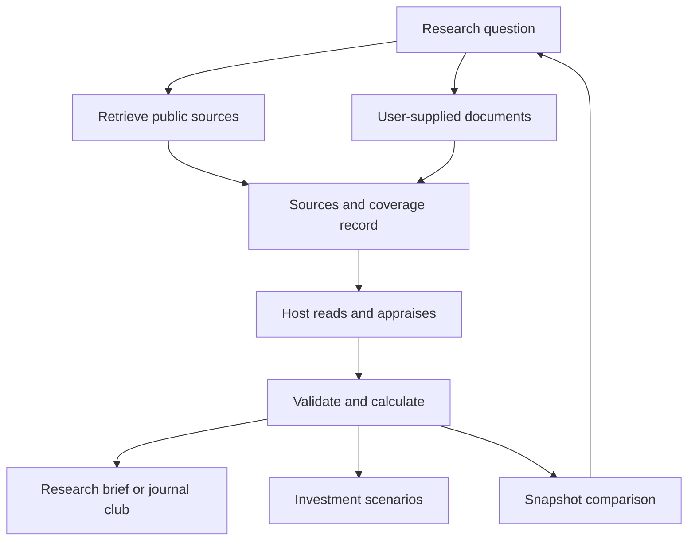

# HH Healthcare Research Suite

**Nine open-source skills and agent workflows for biomedical evidence, clinical trials and healthcare investment research.**

Ask a medical question, compare a trial with its press release, audit citations, monitor a watchlist, or build an explicit biotech valuation. Keep the sources, assumptions, coverage limits and calculations available for review.

[Quickstart](#quickstart) · [Nine projects](#nine-projects) · [Example outputs](examples/outputs/) · [MCP integration](docs/mcp.md) · [Validation](docs/validation.md)

**Status: v0.1.0 research preview.** The Python utilities run data retrieval, comparisons, validation and calculations. The skills and agent workflows use your AI host for reading, appraisal and interpretation. No model provider is called by the Python package; no background jobs are activated by installation.

## See what it does

> “Compare this Phase III press release with the registry and paper. Show what is supported, what differs and what remains unknown.”

The [Clinical Trial Analyst](docs/clinical-trial-analyst.md) produces a document comparison, explains limitations and identifies evidence to retrieve next. The [synthetic worked example](examples/outputs/trial.md) shows endpoint/timepoint differences, missing analysis information and an enrollment discrepancy without claiming that any discrepancy proves misconduct.

> “Build bear/base/bull rNPV scenarios and show every probability-weighted cash flow.”

The [rNPV Modeler](docs/biotech-rnpv-modeler.md) provides [transparent scenario calculations](examples/outputs/rnpv.md), including development costs, asset value and the equity bridge. Probabilities remain explicit user assumptions.

## Nine projects

| Project | What you get | Skill | Example |
|---|---|---|---|
| [Medical Evidence Skills](docs/medical-evidence-skills.md) | Ten reusable procedures for PICO, search, appraisal, extraction, verification and explanation | [Instructions](skills/medical-evidence-skills/SKILL.md) | [Evidence brief](examples/outputs/evidence.md) |
| [Clinical Trial Analyst](docs/clinical-trial-analyst.md) | Registry–publication–press-release comparison and appraisal workflow | [Instructions](skills/clinical-trial-analyst/SKILL.md) | [Trial comparison](examples/outputs/trial.md) |
| [Biomedical Claim Checker](docs/biomedical-claim-checker.md) | Claim-by-claim assessment with source passages and rationale | [Instructions](skills/biomedical-claim-checker/SKILL.md) | [Claim audit](examples/outputs/claims.md) |
| [Biotech Catalyst Radar](docs/biotech-catalyst-radar.md) | Fixed-watchlist registry snapshots and change reports | [Instructions](skills/biotech-catalyst-radar/SKILL.md) | [Changes](examples/outputs/catalysts.md) |
| [Literature Review Assistant](docs/literature-review-assistant.md) | Reproducible searches, conservative deduplication and screening worklists | [Instructions](skills/literature-review-assistant/SKILL.md) | [Worklist](examples/outputs/literature.md) |
| [Healthcare Public Data Toolkit](docs/healthcare-public-data.md) | ClinicalTrials.gov, PubMed, openFDA and CMS clients; optional stdio MCP | [Instructions](skills/healthcare-public-data/SKILL.md) | [Coverage example](examples/outputs/public-data.md) |
| [Biotech rNPV Modeler](docs/biotech-rnpv-modeler.md) | Explicit probability-weighted cash flows and scenario valuation | [Instructions](skills/biotech-rnpv-modeler/SKILL.md) | [Valuation](examples/outputs/rnpv.md) |
| [Conference Evidence Agent](docs/conference-evidence-agent.md) | Public-material triage, incremental evidence and overlapping-cohort checks | [Instructions](skills/conference-evidence-agent/SKILL.md) | [Conference brief](examples/outputs/conference.md) |
| [Journal Club Agent](docs/journal-club-agent.md) | Source-linked appraisal and an eight-slide Markdown briefing | [Instructions](skills/journal-club-agent/SKILL.md) | [Journal club](examples/outputs/journal-club.md) |

Every project includes a portable `SKILL.md`, host-facing metadata, methodology, prompt recipes, an input/output contract and an [agent workflow](agents/). Journal Club is the ninth addition to the original eight-project shortlist.

## Quickstart

These instructions select the implementation branch so this preview can be used before merge.

Python 3.10+; the core package uses only the Python standard library at runtime.

```bash
git clone --branch feat/healthcare-research-suite-nine-tools https://github.com/hh-health-AI/healthcare-equity.git
cd healthcare-equity/research-suite
python3 -m venv .venv
# macOS / Linux
source .venv/bin/activate
# Windows PowerShell: .venv\Scripts\Activate.ps1
python -m pip install .
hh-research --help
python scripts/run_demo.py
```

The demo writes **nine synthetic reports** under `outputs/demo/` without network calls, API keys or an LLM. The JSON fixtures and their limitations are visible in [examples](examples/). Use them to learn the format, not as medical or investment evidence.

For a real public record:

```bash
hh-research data trial --id NCT04280705 --out outputs/trial-record.json
hh-research data pubmed --query '32445440[uid]' --max-records 1 --out outputs/paper.json
hh-research data trials --query 'diabetes' --max-records 20 --out outputs/trial-search.json
```

Requests are sent to the named public services. Optional keys are read from `NCBI_API_KEY` and `OPENFDA_API_KEY`. `HH_CONTACT` can identify your client. No keys belong in committed files. Live data may change, be incomplete or require source-specific reuse permissions.

## Use the skills with your AI host

You can point your host at a skill's `SKILL.md` directly or copy selected skill directories into the location your host is configured to scan. For an explicit project directory:

```bash
python scripts/install_skills.py --target ./my-host-skills --skill clinical-trial-analyst
# Or copy all nine:
python scripts/install_skills.py --target ./my-host-skills-all --all
```

The installer never overwrites existing skills. Configure your host to load that directory according to its documentation. `agents/openai.yaml` supplies optional UI metadata; the core instructions use the open Agent Skills format. This release does not claim installation or end-to-end testing in every AI application.

Start with:

- “Use Clinical Trial Analyst to compare these three sources.”
- “Use Biomedical Claim Checker to audit the evidence supporting these claims.”
- “Use Literature Review Assistant to produce an auditable screening worklist.”

Skills can guide manual work without Python. Install the utilities to run the documented validation and calculations. A host without browsing/data tools cannot retrieve new sources merely by installing instructions.

## Run each utility

Run from this directory after installation. See [input contracts](docs/input-contracts.md) before supplying real data.

```bash
hh-research evidence examples/evidence.json --out outputs/evidence.md
hh-research trial examples/trial.json --out outputs/trial.md
hh-research claims examples/evidence.json --out outputs/claims.md
hh-research literature examples/literature.json --out outputs/literature.md
hh-research catalysts --before examples/snapshot-before.json --after examples/snapshot-after.json --out outputs/changes.md
hh-research rnpv examples/valuation.json --out outputs/valuation.md --json-out outputs/valuation.json
hh-research conference examples/conference.json --out outputs/conference.md
hh-research journal-club examples/evidence.json --out outputs/journal-club.md
hh-research data cms-discover --keyword 'Medicare Part D Prescribers' --out outputs/cms-catalog.json
```

A successful structured operation exits 0. Invalid inputs or failed data retrieval exit 2. The core utilities do not use an LLM to infer claim validity: appraisals must be supplied by a researcher or a host that has read the sources.

## Monitor a watchlist

```bash
hh-research watch --ids NCT04280705 --state outputs/watch-state.json --out outputs/watch-report.md
```

The first invocation establishes a baseline. A later invocation compares the same NCT IDs. Failed/incomplete fetches preserve the previous state. Run jobs sequentially against a state file. Archive snapshots separately if you need full history. Scheduling is documented in [monitoring](docs/monitoring.md) and remains opt-in.

## MCP integration

```bash
python -m pip install '.[mcp]'
hh-healthcare-mcp
```

This starts a local **stdio** server exposing 13 read-only data and analytical tools, using the official Python MCP SDK v1 API with an explicit `<2` dependency bound. It supplies no hosted URL and opens no HTTP listener. Follow the [MCP configuration guide](docs/mcp.md) for a client configuration and verification.

## Evidence workflow



This suite lives alongside the existing [healthcare-equity platform](../README.md). It supplies a broader biomedical research entry point and hands evidence to the existing clinical, reimbursement, utilization, safety and investment modules. It does not replace their specialized workflows or silently certify their data completeness.

## Reliability and limits

- Source identifiers, retrieval timestamps, exact queries and response hashes accompany live data.
- Capped results are disclosed. CMS samples always remain explicitly incomplete and cannot support population totals or market-share estimates.
- Missing data remain missing. Failed monitoring calls do not become “no change.”
- Claim checking includes source passages; structural validation is not proof of truth.
- Trial comparisons flag extracted differences; historical sources and human appraisal determine their meaning.
- Literature counts are screening-worklist counts, not automatically a complete systematic review or PRISMA flow.
- Conference public/embargo metadata must be verified by the researcher; the utility enforces supplied timestamps.
- rNPV probabilities and forecasts are assumptions, not validated clinical-success predictions.
- Journal Club exports Markdown, not a PPTX file.

The design supports inspectable research. **Independent clinical validation, universal host compatibility and investment performance are not claimed.** See [validation](docs/validation.md) for the exact checks performed.

## Develop and contribute

```bash
python -m pip install '.[dev,mcp]'
python -m unittest discover -s tests -v
python scripts/validate_package.py
# Optional network checks:
python scripts/live_smoke.py --out outputs/live-validation.json
```

Contribute a reproducible failure case, a reviewed source adapter, a new domain example or a clearer methodology. Use synthetic/de-identified fixtures and preserve source licensing. See [contribution guidance](CONTRIBUTING.md).

## Sources and license

[Agent Skills specification](https://agentskills.io/specification) · [ClinicalTrials.gov API](https://clinicaltrials.gov/data-api/api) · [NCBI E-utilities](https://www.ncbi.nlm.nih.gov/books/NBK25501/) · [openFDA API](https://open.fda.gov/apis/) · [CMS developer documentation](https://data.cms.gov/api-docs) · [MCP Python SDK](https://github.com/modelcontextprotocol/python-sdk/tree/v1.x)

MIT, under the repository's [license](../LICENSE). Public-source content retains its own terms. HH Health AI is not affiliated with the named agencies or AI platforms. Research support only; outputs require appropriate professional review before clinical, regulatory or investment use.
